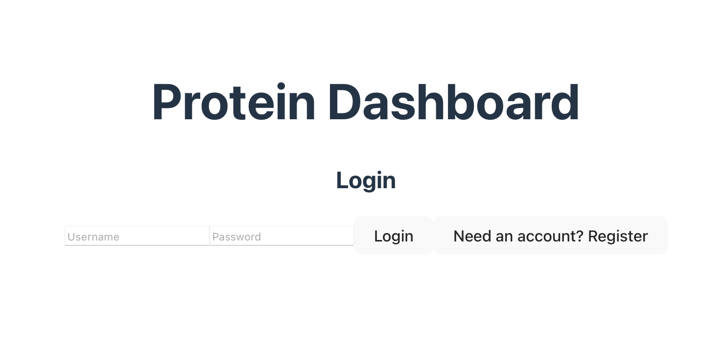
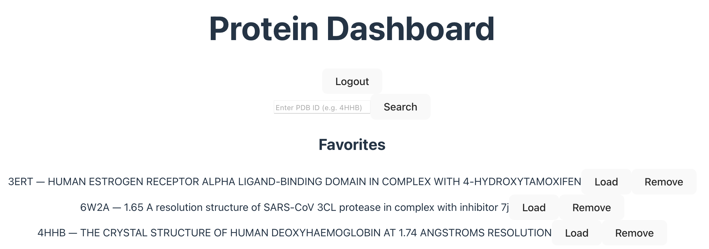
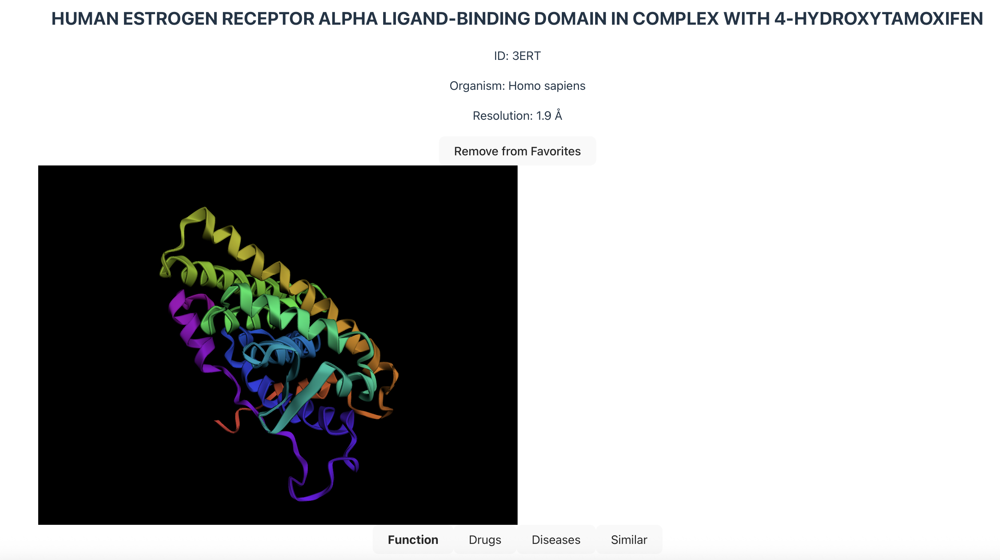
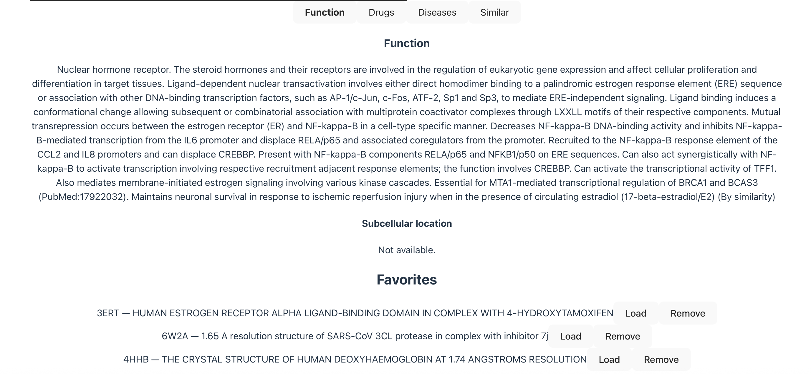
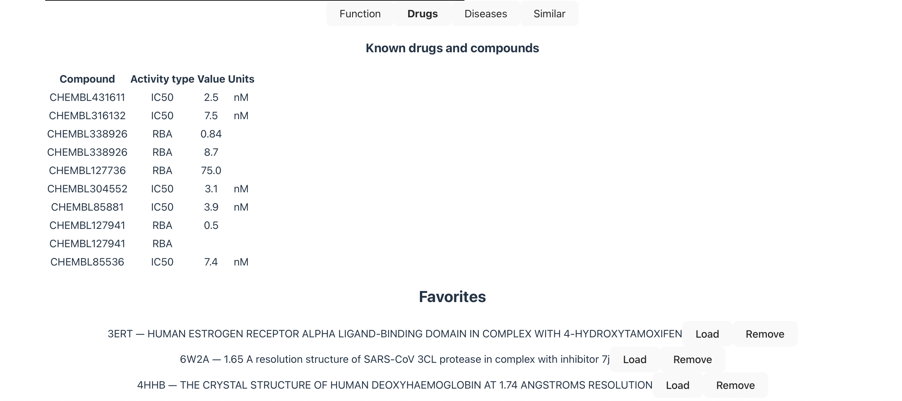
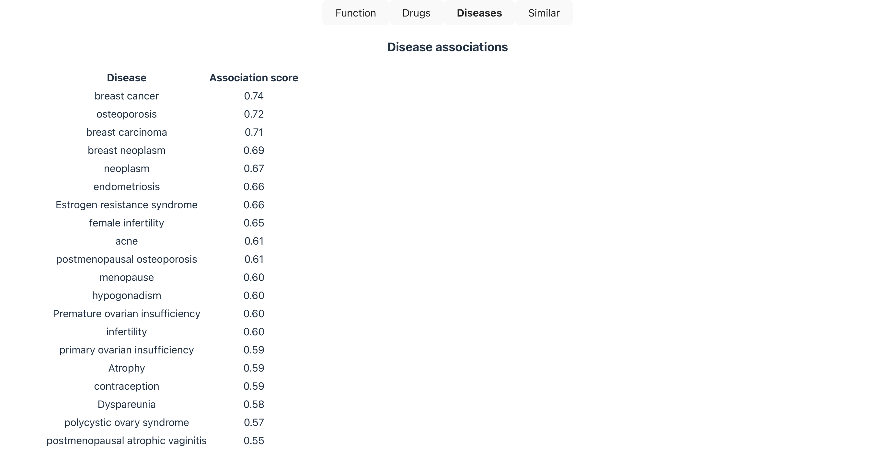
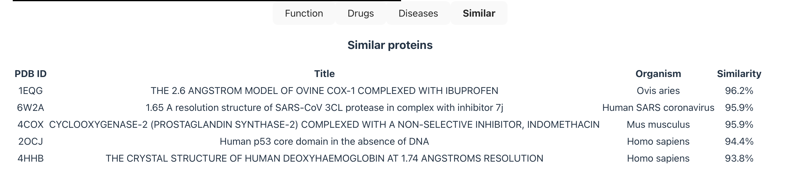

# Protein Dashboard

## Summary

A full-stack protein research platform for searching and visualizing protein structures from the RCSB Protein Data Bank, enriched with functional annotation, drug interaction, and disease association data from multiple biomedical databases. Includes ML-powered protein similarity search using sequence embeddings.

## Screenshots

### Login


### Home Screen


### 3D Structure


### Function Tab


### Drugs Tab


### Diseases Tab


### Similar Proteins Tab


## Features
- Register and log in with a username and password
- Search proteins by PDB ID
- Display protein metadata including title, organism, and resolution
- Interactive 3D structure visualization rendered in the browser
- Tabbed detail panel with data from four biomedical APIs:
   - Function: protein function and subcellular location from UniProt
   - Drugs: known drug compounds and bioactivity data from ChEMBL
   - Diseases: disease associations and evidence scores from Open Targets
   - Similar proteins: ML-powered similarity search using ESM-2 sequence embeddings and pgvector cosine similarity
- Cache protein metadata and annotations in PostgreSQL to reduce redundant API calls
- Save and manage favorite proteins that persist across sessions tied to individual user accounts. 

## Tech Stack

### Frontend
- Javascript (React, Vite)
- 3Dmol.js for 3D structure rendering

### Backend
- Java 21
- Spring Boot
- Spring Data JPA / Hibernate
- JdbcTemplate with native SQL (JSONB annotation storage and pgvector similarity queries)
- Parallel async fan-out architecture using Completable Future
- Spring Async for non-blocking embedding generation

### External APIs
- RCSB PDB REST API: protein structure metadata and sequences
- UniProt REST API: protein function, pathways, and cross-references
- ChEMBL REST API: known drug compounds and bioactivity data
- Open Targets GraphQL API: disease associations and evidence scores

### ML/Embeddings
- ESM-2 (Meta) protein language model running as a Python FastAPI sidecar service
- pgvector PostgreSQL extension for cosine similarity search over 320-dimensional sequence embeddings

### Database
- PostgreSQL (Supabase)
- Five tables: users, proteins (metadata cache), favorites (user saved proteins), protein_annotations (JSONB), and protein_embeddings (pgvector)

### Infrastructure & DevOps
- Docker & Docker Compose
- AWS ECS/EC2 for container hosting
- AWS ECR for container image registry
- AWS CloudWatch for logging
- AWS S3 for Terraform remote state
- Terraform for infrastructure as code
- GitHub Actions for CI/CD

## Architecture
```
React frontend → Nginx reverse proxy → Spring Boot backend → RCSB PDB REST API
                                                           → UniProt REST API
                                                           → ChEMBL REST API
                                                           → Open Targets GraphQL API
                                                           → ESM-2 embedding service (async)
                                                           → PostgreSQL / Supabase
                                                               ├── proteins (JPA)
                                                               ├── users (JPA)
                                                               ├── favorites (JPA)
                                                               ├── protein_annotations (JdbcTemplate / JSONB)
                                                               └── protein_embeddings (JdbcTemplate / pgvector)
```


## Requirements
- JDK 21
- Node.js (LTS)
- Maven
- Docker Desktop
- Python 3.11 (embeddings service)
- AWS CLI
- Terraform

## To Run Locally

### Docker Compose
To run all services (frontend, backend, and embeddings) together with Docker:
```
docker compose up --build
```
The app will be available at http://localhost

### Backend

From the project root:
```
./mvnw spring-boot:run
```
the backend will start on http://localhost:8080

### Frontend 
From the client directory:
```
npm install
npm run dev
```
The frontend will start on http://localhost:5173

### Embeddings
From the embeddings directory:
```
pip install -r requirements.txt
uvicorn main:app --host 0.0.0.0 --port 8000
```

### Environment variables
Create a .env file in the project root with:
```
SPRING_DATASOURCE_URL=jdbc:postgresql://<host>/<db>
SPRING_DATASOURCE_USERNAME=<username>
SPRING_DATASOURCE_PASSWORD=<password>
```

## Cloud Deployment
Infrastructure is managed with Terraform and deployed to AWS ECS/EC2.

### Spin Up Infrastructure
```
cd terraform
terraform init
terraform apply
```

### Tear Down Infrastructure
```
terraform destroy
```

CI/CD is managed by GitHub Actions, a non-trivial push to main automatically   
builds and pushes Docker images to ECR and deploys to ECS.  
The workflow can also be triggered manually from the Actions tab in GitHub without pushing code. 


## Usage
1. Register a new account or log in with existing credentials
2. Enter a PDB ID in the search box (e.g. 3ERT, 2OCJ, 1IEP)
3. Click Search or press Enter
4. View the protein metadata and interact with the 3D structure
5. Browse the Function, Drugs, Diseases, and Similar tabs for enriched data
6. Open the Similar tab to trigger ML-powered similarity search; results populate asynchronously as embeddings generate
7. Click Add to Favorites to save the protein for later
8. Use the Favorites list (at the bottom of the screen) to reload or remove saved proteins
9. Click logout to end the session

### API
The backend exposes the following endpoints:
```
POST   /api/auth/register          — register a new user
POST   /api/auth/login             — log in and receive a JWT token
GET    /api/protein/{pdbId}        — fetch full protein detail (structure, annotations, similar proteins)
GET    /api/protein/{pdbId}/similar — fetch ML-powered similar proteins by embedding cosine similarity
GET    /api/favorites              — list all favorited proteins for the current user
POST   /api/favorites/{pdbId}      — add a protein to favorites
DELETE /api/favorites/{pdbId}      — remove a protein from favorites
```
All endpoints except /api/auth/** require a valid JWT token in the Authorization header.
